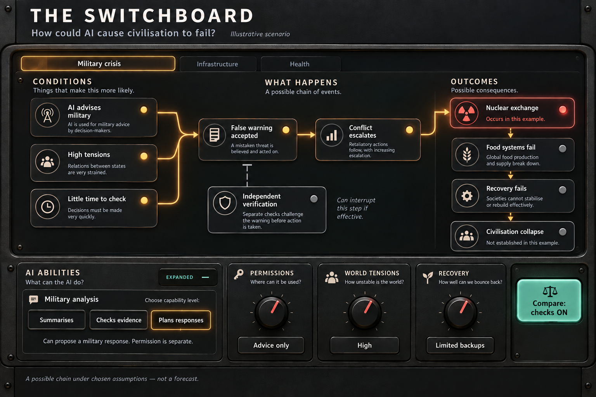

# The Switchboard — build specification

Version 0.1 · 21 September 2026 · Ready for design and implementation planning; quantitative calibration remains open.

## 1. Product contract

Build an exceptionally polished, explorable causal machine answering: **How could AI contribute to civilisation collapse, and what additional conditions would be required for human extinction?**

A first-time eleven-year-old should understand an input and its immediate consequence without reading a manual. A sceptical adult should be able to inspect the complete reasoning, challenge an assumption, and compare an alternative. Curiosity, agency, discovery and visual pleasure must survive that depth.

One continuous world contains military, infrastructure, health, information, governance, AI development, and recovery. Focus controls change the camera, never the scenario. Simulation outcomes emerge from explicit rules and saved uncertainty samples. Cinematic presentation makes those rules perceptible.

### Confirmed direction

- Desktop/laptop is the target. Optimise 1440 × 900 and support 1280 × 720 through 2560 × 1440, including ordinary display scaling. Phone layout is outside the initial release scope.
- Civilisation collapse is the principal modelled terminal classification. Additional pathways towards extinction must be inspectable. Collapse never silently means extinction.
- GitHub Pages or OpenAI Sites is acceptable. Recommend GitHub Pages for the initial release because the user knows it and the core can be static.
- No fixed running-cost ceiling. Any later OpenAI runtime service uses the user's Cloudflare proxy pattern. JEV is a candidate extension, not a core requirement.
- The user handles recruitment and user testing. The build supplies test scenarios and an observation guide.
- Astra High is the chosen build-spec setting. It is sufficient for this document. Flag a recommended increase before difficult full-model reconciliation or adversarial review; do not imply the setting changed automatically.
- The current deliverable is specification and research planning, not application code or deployment.

### Quality reference

This generated image establishes material quality and readability. It is not an executable model, a calculation, or the final world composition. Its few cards cannot define the full model. Its permission and ability labels need the operational definitions below.

## 2. Meaning of finished

The release is complete only when the following are demonstrated together:

1. Newcomers can change a setting, identify the changed mechanism, and explain a consequence.
2. All seven pathway families in the model specification are represented, with cross-domain dependencies and interruption routes.
3. Every active outcome links to an event record and inspectable model assumptions. Every important edge has a mechanism, provenance and limitation.
4. Ability, authority, harmful behaviour, exposure, propagation and recovery remain distinct concepts throughout.
5. Overview, domain and mechanism views describe the same state with stable geography.
6. Input changes update visible mechanisms promptly. An optional causal trace explains a result already available; users never wait for a fictional calendar to elapse.
7. Before/after comparisons preserve background circumstances and uncertainty samples. Saved scenarios replay against their recorded model version.
8. The real interface achieves the reference's tactile quality, with readable labels, restrained light, deliberate animation and consistent interaction.
9. Testing finds no unexplained active outcomes, shared-cause double-counting, unreachable controls, misleading histogram denominators or inaccessible essential actions.
10. User testing demonstrates comprehension and voluntary exploration. A functioning build alone does not satisfy this condition.

Detailed tests and unresolved scientific issues appear in the companion documents. A first working section is a quality gate towards this release, not a substitute for it.

## 3. The continuous world

Use a carefully authored, stable map. Do not run a force-directed layout that continually changes positions. Pan and semantic zoom reveal detail without rearranging the world's geography.

### Spatial composition

| Area | Contents | Principal outward connections |
|---|---|---|
| Left: AI development and deployment | Domain abilities, research feedback, autonomy, behavioural assumptions, access | Military use, critical systems, science, information |
| Upper middle: military and international relations | Warning quality, verification time, command authority, escalation | Communications, government, infrastructure, food consequences |
| Centre: shared infrastructure | Power, communications, logistics, payments, water | Every domain; visibly shared rather than duplicated |
| Lower middle: health and food | Detection, health demand, medical supplies, food access | Logistics, power, cooperation, recovery |
| Upper/right middle: information and governance | Trusted information, coordination, institutional continuity | Verification, crisis response, restoration |
| Lower continuous band: resilience | Reserves, independent operation, repair, surviving regional capacity | Return routes into damaged systems |
| Right: consequences | Severe service loss, strategic conflict, health crisis, loss of control; collapse classification | Recovery outcomes and an expandable extinction lens |

This composition is a topology proposal, not a claim that the real world fits a left-to-right pipeline. Feedback is represented by return edges with explicit delays.

At overview, show roughly 8–12 major clusters and the most relevant connections. Domain view exposes roughly 6–15 mechanisms. These are design budgets, not limits on underlying model size. Control the visible density through focus and grouping, not by omitting causal prerequisites.

Shared dependencies have one model identity. Visual portals can repeat a label to avoid long crossing wires, but must indicate that they reference the same component.

### Persistent interface

- Top: title, current scenario, visible mode, horizon, undo/redo, save/share, whole-world control.
- Main surface: network and consequences, with a small overview locator when zoomed.
- Bottom: compact input banks. Opening one reveals its children while retaining the selected causal route.
- Context inspector: an anchored side panel for meaning, explanation, comparison and evidence. It must not cover the component being explained.
- Change sentence: a persistent, concise statement of what the most recent adjustment changed. It is generated from model differences, not generic copy attached to a knob.

Keyboard and pointer equivalents exist for selection, adjustment, pan, zoom and returning home. Scroll zoom anchors at the pointer; explicit controls remain available. Escape exits a focused inspection without discarding settings. Undo restores settings, not just camera position.

## 4. Three ways to inspect the same world

### Conditions — default

Show prerequisites, access, potential routes and safeguards under current settings. Lamps indicate route status, not event occurrence. A route can be blocked here, conditionally open, or unresolved. The caption explicitly says that an enabled route has not necessarily happened.

### Example outcome

Inspect a reproducible simulated case. Lamps indicate events that occurred, interventions that worked, and subsequent recovery. The selected case and whether an incident was deliberately introduced are visible. Show a trace on demand, but keep the result available immediately.

### Range of outcomes

Inspect repeated runs under a declared assumption set. Show outcome frequencies, service loss and recovery-time distributions. Retain no-event and no-recovery-within-horizon categories. Selecting a run opens its exact record. Never silently choose the most catastrophic run as representative.

The same colours have consistent meanings within each clearly labelled mode. Grey never means safe: it can mean not reached, not observed, or unresolved, and the adjacent label must identify which.

## 5. Visual grammar

| Element | Meaning |
|---|---|
| Knob / stepped switch | User-editable input; only in an input bank or explicit edit panel |
| Flat lamp / meter | Calculated or recorded state; never styled as a knob |
| Labelled junction | Explicit all-required, alternative-route or contributing-factor relationship |
| Barrier crossing an edge | A safeguard can interrupt this particular transition |
| Solid illuminated connection | An active relationship or recorded event, as specified by the mode |
| Dashed connection | Conditional or hypothetical continuation; label the missing prerequisite |
| Return connection | Recovery or feedback with an inspectable mechanism and delay |
| Previous-state outline | Comparison reference, never another current event |

Graphite and charcoal surfaces, warm white labels, mint interventions, amber exposure and restrained coral harm. Shape and text duplicate colour information. Unselected components remain readable; focus must not reduce them to illegible decoration.

Use shallow material depth and finely controlled shadows. No decorative rotating globe, countdown, explosion footage, endless particle traffic or dense fake telemetry. The drama comes from consequential changes and visible remaining alternatives.

Normal movement: immediate control feedback, 150–250 ms emphasis changes, optional causal traces around 0.6–1.2 seconds. These are adjustable design targets. Reduced motion provides equivalent static highlights. Sound starts off and only reinforces discrete actions.

## 6. Inputs people can understand

Six expandable banks contain individual controls, not six universal numerical sliders. A bank summary describes its settings; it is not a hidden weighted risk score. Overview shortcuts may expose a meaningful child control. Presets may change multiple children only when all changed values are shown.

| Bank | Initial control inventory |
|---|---|
| AI abilities | Cyber task capability; science assistance; military analysis; reliable independent task duration; physical task capability; AI research automation; persistence capability |
| Permissions and exposure | Sector-specific advise/approve/act; tool access; deployment breadth; network reach; high-consequence military coupling; research/deployment authority; physical resources |
| Behaviour assumptions | Ordinary error; objective mismatch; conditional harmful propensity; concealment capability; malicious-user pressure |
| Checks and containment | Evaluation coverage; independent verification; monitoring delay; response delay; permission revocation; isolation; diversity of checks |
| World conditions | Rivalry; crisis state; provider concentration; service dependence; trusted information; international coordination; concurrent background stress |
| Recovery | Sector reserves; substitute supply; manual fallback; repair capacity; health surge capacity; outbreak detection; government continuity; regional diversity |

This is a proposed inventory of roughly forty control dimensions, some sector-specific. Consolidate only where the underlying semantics genuinely match. Do not expose them all on first entry.

Each control record must include: plain question, exact variable, value/units, operational anchors, can/cannot explanation, affected edges, evidence status, plausible range, scenario default, and whether it is a choice or an uncertain assumption.

Example: **AI research — runs experiments.** “It can propose and test candidate improvements within the supplied compute budget. People still decide which versions are deployed.” Increasing this alone does not grant deployment authority or physical resources.

Example: **Independent operation — several hours.** “It can reliably carry out a task of this duration in the modelled domain without a person correcting each step.” Duration is not a universal intelligence ranking.

Example: **Hospital backup — 3 days at critical load.** “Critical equipment can continue during a power outage while fuel lasts.” The value is a scenario choice, not a measurement of actual hospitals worldwide.

No generic ‘alignment solved’ slider. Behaviour assumptions and the effectiveness of proposed safeguards remain separately inspectable. Named stages are educational anchors, not claims that all real systems form a single ordered ladder.

## 7. Learning and exploration

Opening: a readable whole world with one short chain highlighted. Prompt: **Change what AI is allowed to control. Watch which connections open.** The initial state must allow both interruption and escalation through modest changes; it is labelled an illustrative world.

Core actions:

- **Why is this lit?** Trace recorded prerequisites backwards, including concurrent contributors.
- **Follow this chain.** Frame the complete selected route across domains.
- **What changed?** Isolate the latest state difference; preserve previous values as a ghost.
- **What if this link is wrong?** Disable or alter an uncertain mechanism and compare. Mark the altered assumption clearly.
- **Same crisis, different AI role.** Pair cases using the same background shock while changing specified AI participation. This is a comparison within the model, not proof of real-world causal attribution.
- **Try other possible events.** Explicitly change the seed; ordinary knob changes preserve it.
- **Show the path towards extinction.** Reveal additional requirements and the limits of the model.

Optional challenges teach identifying a shared dependency, containing an incident and preserving recovery. Success can include explaining uncertainty. No score for maximising deaths and no forced apocalypse. Useful AI contributions such as detection and repair can be included only when modelled explicitly; no invented prosperity meter.

## 8. Delivery and implementation architecture

Recommended: a static TypeScript application built for GitHub Pages, with semantic HTML/CSS controls, an SVG causal surface and a browser worker for simulations. This is an architectural choice, not application code. Confirm library versions and compatibility when implementation starts.

Use SVG for legible interactive diagrams and DOM for accessible controls. Evaluate Canvas only if measured visual density requires it; preserve accessible semantic equivalents. Tactile materials should be CSS/vector treatments, not a flattened screenshot that cannot adapt.

Separate modules: model definitions, simulation engine, event/provenance record, comparison analysis, view model, visual renderer and evidence library. The graph consumes engine state; animations never calculate outcomes. Navigation state is distinct from scenario state.

Version parameters, rules, evidence and saved scenarios. Import validates schema and bounds. Old exports either replay with their model version or report incompatibility; never silently reinterpret them.

GitHub Pages serves the compiled static assets [S6]. Use repository-relative asset paths and hash-based navigation/state links so deep links work without server rewrites. Store compact scenario configuration and seed in share links, not API keys or huge event histories; offer a file export for full records. Save locally with visible reset/clear controls. No account is required for the core.

If a later online helper is justified, call the Cloudflare proxy, which owns credentials, validation, rate limits and provider calls. Core controls and saved replays continue working when that service is unavailable. No runtime AI is required for the initial release. Sites remains an alternative host, not an additional implementation dependency.

## 9. Responsiveness targets

Measure on an agreed ordinary laptop, recording browser, hardware and scenario size. Targets are budgets to verify, not achieved claims:

- Control feedback under 50 ms; never block dragging on ensemble computation.
- Conditions view updates under 100 ms for the intended graph size.
- A selected case completes under 250 ms on typical scenarios; expensive cases show honest computation status.
- A labelled preview ensemble settles within about 1 second; larger samples refine asynchronously.
- Smooth pan/zoom near 60 fps at typical density; reduced effects preserve legibility on slower devices.

Cancel obsolete computations and tag every result with its configuration ID. While a new result is pending, identify the old result rather than presenting it under new inputs. Never fabricate instantaneous exact distributions.

## 10. Build gates

1. **Model and content foundation:** resolve source links; author the causal register; define all input meanings; establish tests and uncertainty policy. Numerical gaps remain explicit.
2. **Design proof:** whole-world composition plus semantic zoom; material controls; keyboard navigation; one cross-domain route. Check screen density at target laptop sizes.
3. **Working section:** AI participation in communications disruption, military verification and hospital recovery share the same communications state. Paired changes and their explanations come from the engine. This must meet the visual bar before expansion.
4. **Complete modelled scope:** implement all pathway families, recovery, comparisons, distributions, extinction inspection and evidence panels. Audit common causes and feedback.
5. **User testing and revision:** the user supplies testers; fix comprehension failures as product defects. Refine labels, defaults and navigation based on observation.
6. **Release:** performance, accessibility, scenario compatibility, browser and deployment checks; publish the intended build with a model/version/limitations record.

Do not confuse scientific validation with passing software tests. Obtain domain review where possible; unresolved mechanisms stay visibly uncertain. No new user decision blocks the specification. The repository/account and deployment details are needed only when publication approaches.

## Companion documents

- [Model specification](docs/MODEL_SPEC.md)
- [Research register and JEV assessment](docs/RESEARCH_REGISTER.md)
- [Acceptance tests and user-testing guide](docs/ACCEPTANCE.md)

Source IDs refer to the research register. The local research report is the source of the initial pathway inventory, not proof that its proposed coefficients are calibrated.
